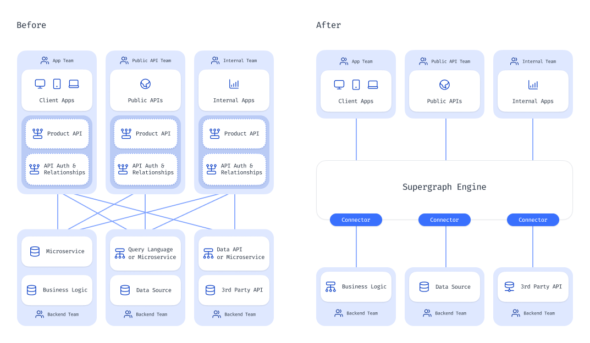
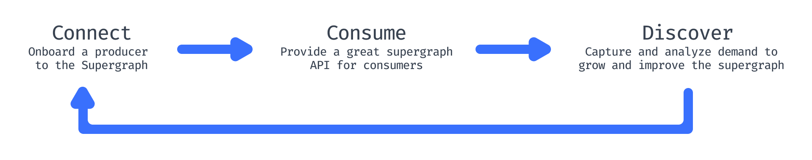
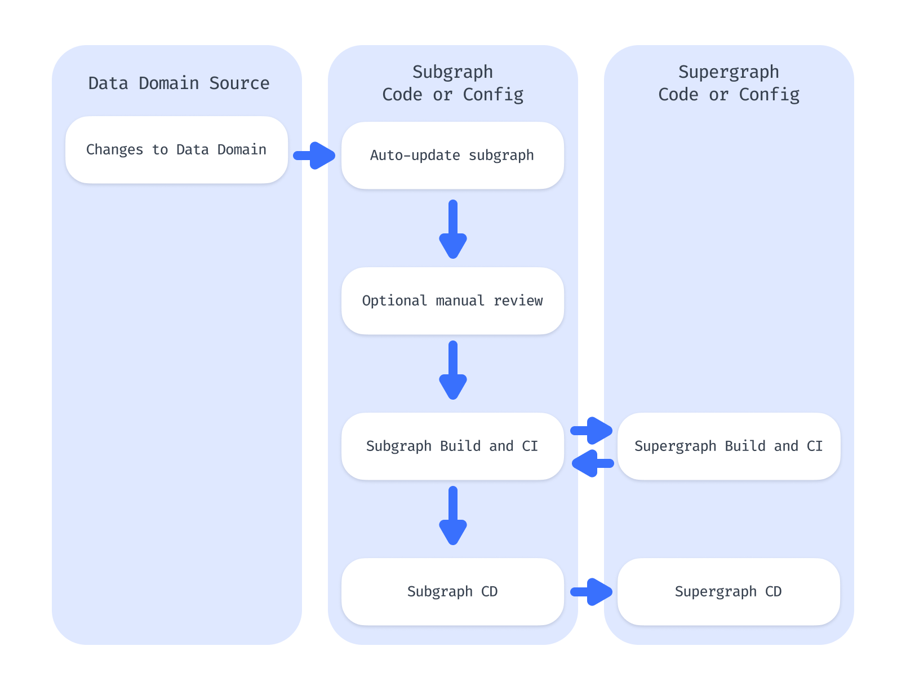
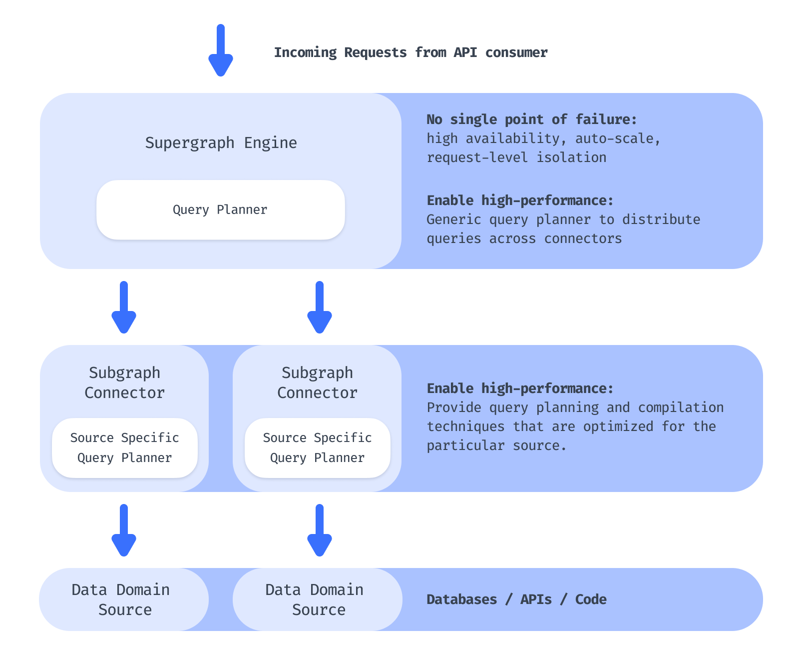

# The Supergraph Manifesto

## Introduction

In data API design, a Supergraph is an API development methodology that offers reference specifications, design 
principles and an operating model. By implementing a Supergraph methodology, multiple teams in an organization can 
easily collaborate to deliver a modular, interconnected resource of data and logic to create a single, powerful, 
self-serve endpoint for API consumers.

## Table of Definitions
| Term               | Definition                                                                                                                     |
|--------------------|--------------------------------------------------------------------------------------------------------------------------------|
| **Supergraph**     | A Supergraph is an API creation methodology that offers reference specifications, design principles and an operating model.    |
| **supergraph API** | A modular, interconnected resource of data and logic as a single, powerful, self-serve API endpoint.                           |
| **Engine**         | Often referred to as a gateway or router in a GraphQL federation stack, managing API requests and responses.                   |
| **Data Domain**    | A distinct area of functionality or data.                                                                                      |
| **Subgraph**       | A modular component that acts as a self-contained entity within a larger supergraph and often represents a single data domain. |
| **API Consumer**   | An entity that uses APIs to access data and functionality.                                                                     |
| **API Producer**   | An entity that creates and maintains APIs.                                                                                     |

## Before the Supergraph
In conventional API design, data consumers need to manually access, integrate, and compose data from multiple 
endpoints to get the data they need. This is time-consuming, error-prone, and requires deep domain knowledge, often 
resulting in brittle integrations.

Infrastructure must also be built and maintained to support each of these data-access processes, and individual 
routes or resolvers built and maintained for each data access requirement.



## Benefits
A Supergraph provides the following key benefits:

1. **Self-Serve API Consumer Composition**: Enables API integration, orchestration, and aggregation in a self-serve 
   manner.
2. **Federated Data Access Layer**: Provides a federated data layer that allows real-time access to data sources with
   cross-domain composability (joins, filtering, etc.).
3. **Incremental Adoption**: Offers a stable API that supports zero-downtime and incremental adoption.

## Supergraph Lifecycle



### Connect Domains
As an API producer, you should easily and seamlessly connect your data domains to the platform. The Supergraph strategy 
and architecture addresses common challenges and reluctance from domain owners by ensuring:

1. **Subgraph Connector CI/CD**: Keeps the API contract in sync with minimal overhead for the domain owner.
2. **Subgraph Connector Performance**: Maintains or improves performance compared to direct access to the underlying 
   domain.

### Consume APIs
API consumers should be able to discover and consume APIs without manual integration, aggregation, or composition 
efforts as far as possible. Key requirements include:

1. **Composable API Design**: Allows on-demand composability, often utilizing GraphQL for expressive API design.
2. **API Portal**: Provides high-quality search, discovery, and documentation to facilitate self-serve consumption.

### Discover Demand
Understanding how API consumers use domains and identifying their unmet needs is crucial for API producers. The 
Supergraph platform supports:

1. **API Consumption Analytics**: Provides insights to improve the API marketplace for consumers.
2. **Ecosystem Integrations**: Integrates with existing tools to understand unmet demand and enhance the ecosystem.

### A Supergraph creates a virtuous cycle of success for API producers and consumers.

## Supergraph Architecture

### Control Plane (CI/CD and Build System)

The control plane ensures seamless connection of data domains to the Supergraph.

There are three components in the control plane of the Supergraph:

#### 1. The data domain itself
A database, API or lambda function that provides the data.
   
#### 2. The subgraph
API models, documentation, relationships, authorization policies. 

#### 3. The Supergraph
Centralized auth, governance, API conventions.

### Control Plane Lifecycle



### Distributed Data Plane
The data plane ensures high-performance access to upstream domains, maintaining domain performance without hidden 
future maintenance costs.



## API Schema Design Guide

<!-- this section needs a reference architecture -->

### Standardization

In relation to **data resources (models)** and **data logic (commands)**, a supergraph API schema should create standardized 
conventions on the following:

<table>
  <thead>
    <tr>
      <td class="fixed-col-width-1"><b>Standardization Attribute</b></td>
      <td><b>Capability</b></td>
    </tr>
  </thead>
<tbody>
  <tr>
  <td><b>S1</b></td>
  <td>
  Separating models and commands
    <details> 
      <summary>Example</summary>

  <ul>
    <li>Models are collections of data that can be queried in standardized source-agnostic ways</li>
    <li>Commands are methods that map to particular pieces of business logic that might return references to other commands or models</li>
  </ul>

```graphql
  # A standardized way to fetch a list of authors
  query GetAuthors {
    authors {
      id
      name
    }
  }

  # A specific method to search for authors
  query findAuthors {
    search_authors(args: {search: "Einstein"}) {
      id
      name
    }
  }
```
 </details>
  </td>
  </tr>

  <tr>
  <td><b>S2</b></td>
  <td>
    Model filtering
    <br/>
    <details>
      <summary>Example</summary>
      Get a list of articles published this year

```graphql
 query articlesThisYear {
    articles(where: {publishDate: {_gt: "2024-01-01"}}) {
      id
      name
    }
  }
```
  </details>
  </td>
  </tr>
  <tr>
  <td><b>S3</b></td>
  <td> 
    Model sorting
  <details>
    <summary>Example</summary>
  Get a list of articles sorted in reverse by the date of publishing

  ```graphql
  query sortedArticles {
    article(order_by: {publishDate: desc}) {
      id
      title
      author_id
    }
  }
  ```
  </details>
  </td>
  </tr>
  <tr>
  <td><b>S4</b></td>
  <td> 
    Model pagination
    <details>
      <summary>Example</summary>
  Paginate the above list with 20 objects per page and fetch the 3rd page

  ```graphql
  query sortedArticlesThirdPage {
    article(order_by: {publishDate: desc}, offset: 40, limit: 20) {
      id
      title
      author_id
    }
  }
  ```
  </details>
  </td>
  </tr>

  <tr>
  <td><b>S5</b></td>
  <td> 
    Model aggregations over fields
    <details>
      <summary>Example</summary>
  Get a count of authors and their average age

  ```graphql
  query authorStatistics {
    author_aggregate {
      aggregate {
        count # basic aggregation support by any model
        avg { # supported over any numeric fields of a type
          age
        }
        
      }
    }
  }
  ```
  </details>
  </td>
  </tr>
</tbody>
</table>


> [!NOTE]  
> ### Prior art
> - [Google Cloud API design guide](https://cloud.google.com/apis/design/resources)
> - Resource: A resource-oriented API is generally modeled as a resource hierarchy, where each node is either a simple resource or a collection resource
> - Method: Resources are manipulated via a small set of methods


### Composability

The supergraph API is typically a GraphQL / JSON API. There are varying degrees of composability an API can offer, as listed out in the following table:

<table>
<thead>
<tr>
<td class="fixed-col-width-1"><b>Composability Attribute</b></td>
<td class="fixed-col-width-2"><b>Capability</b></td> <td><b>Description</b></td>
</tr>
</thead>
<tr>
<tbody>
<td><b>C1</b></td>
<td> Joining data</td>
<td>Join related data together in a "foreign key" like join
  <details>
    <summary>Example</summary>
Get a list of authors and <b>their</b> articles

```graphql
query authorWithArticles {
  author {
    id
    name
    articles {
      id
      title
    }
  }
}
```
</details>
</td>
</tr>

<tr>
<td><b>C2</b></td>
<td> Nested filtering</td>
<td>Filter a parent by a property of its child (i.e. a property of a related entity)
    <details>
    <summary>Example</summary>
Get a list of authors whose have published an article this year

```graphql
query recentlyActiveAuthors {
  author(where: {articles: {publishDate: {_gt: "2024-01-01"}}}) {
    id
    name
  }
}
```
</details>
</td>
</tr>
<tr>
<td><b>C3</b></td>
<td> Nested sorting </td>
<td>Sort a parent by a property of its child (i.e. a property of a related entity)
    <details>
    <summary>Example</summary>
Get a list of articles sorted by the names of their author

```graphql
query sortedArticles {
  article(order_by: {author: {name: asc}}) {
    id
    title
  }
}
```
</details>
</td>
</tr>
<tr>
<td><b>C4</b></td><td> Nested pagination </td>
<td>Fetch a paginated list of parents, along with a paginated &amp; sorted list of children for each parent
    <details>
    <summary>Example</summary>
Get the 2nd page of a list of authors and the first page of <b>their</b> articles, sorted by the article's title field

```graphql
query paginatedAuthorsWithSortedPaginatedArticles {
  author(offset: 10, limit: 20) {
    id
    name
    articles(offset: 0, limit: 25, order_by: {title: asc}) {
      title
      publishDate
    }
  }
}
```
</details>
</td>
</tr>
<tr>
<td><b>C5</b></td><td> Nested aggregation </td>
<td>Aggregate a child/parent in the context of its parent/child
    <details>
    <summary>Example</summary>
Get a list of authors and the number of articles written by each author

```graphql
query prolificAuthors {
  author (limit: 10) {
    id
    name
    articles_aggregate {
      count
    }
  }
}
```
</details>
</td>
</tr>
</tbody>
</table>

These composability attributes are what increase the level of self-serve composition and reduce the need for manual API aggregation and composition.

## More reading

- [Use cases](/use-cases)
- [Reference API schema](/reference-api-schema)
- [FAQ](/faq)
